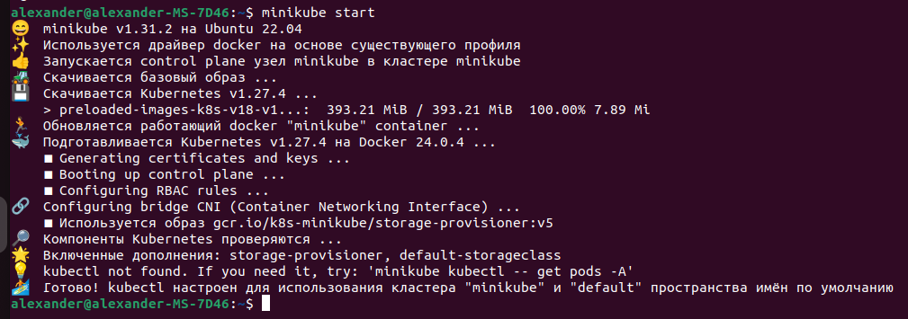
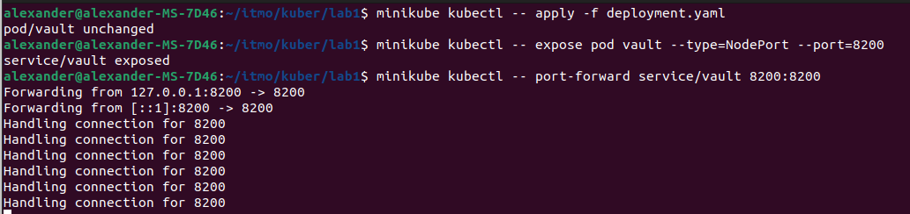
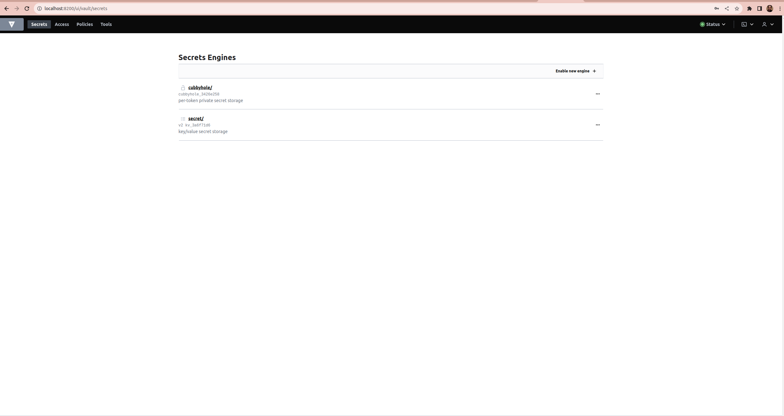
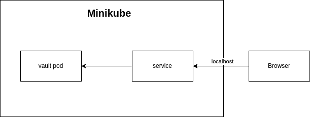

University: [ITMO University](https://itmo.ru/ru/) \
Faculty: [FICT](https://fict.itmo.ru) \
Course: [Introduction to distributed technologies](https://github.com/itmo-ict-faculty/introduction-to-distributed-technologies) \
Year: 2023/2024 \
Group: K4112с \
Author: Krutov Alexander Vladimirovich \
Lab: Lab1 \
Date of create: 17.10.2023 \
Date of finished: <none>
#

### 1. Запуск minikube

### 2. Написание манифеста

### 3. Запуск Vault
#### Применяем манифест:
    minikube kubectl -- apply -f deployment.yaml

#### Создаем сервис:
    minikube kubectl -- expose pod vault --type=NodePort --port=8200

#### Перенаправление порта
    minikube kubectl -- port-forward service/vault 8200:8200

#### Запускается сервис vault на порту 8200

### 4. Авторизация в Vault
  - Копируем имя нашего пода vault и выполняем следующую команду:
        minikube kubectl -- logs vault | grep "Root Token"

#### Используем полученный токен и авторизуемся в vault:

### Cхема:

