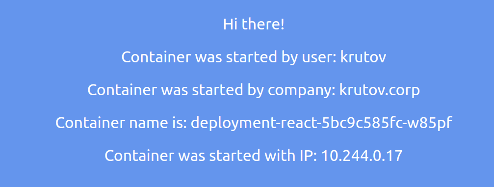
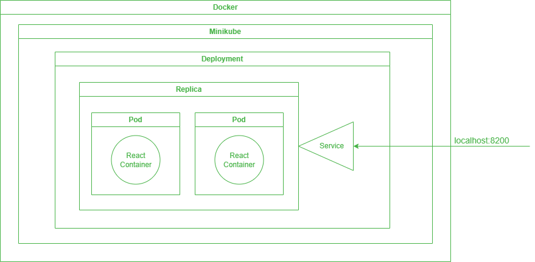

University: [ITMO University](https://itmo.ru/ru/) \
Faculty: [FICT](https://fict.itmo.ru) \
Course: [Introduction to distributed technologies](https://github.com/itmo-ict-faculty/introduction-to-distributed-technologies) \
Year: 2023/2024 \
Group: K4112с \
Author: Krutov Alexander Vladimirovich \
Lab: Lab2 \
Date of create: 26.10.2023 \
Date of finished: <none>


### 1. Запуск minikube
    $ minikube start

### 2. Написание манифест файла
Директория содержит в себе файл `deployment.yaml`, в котором описана конфигурация развертывания deployment'а react-deployment и сервиса react-service.  
Deployment содержит информацию об использованном образе и порте и создает pod'ы с нашим сервисом.  
Service управляет доступом к pod'ам и позволяет перенаправлять на них запросы.

``` yaml
apiVersion: apps/v1
kind: Deployment                                            
metadata:
  name: deployment-react                         
spec:
  replicas: 2
  selector:
    matchLabels:
      app: react
  template:
    metadata:
      labels:
        app: react
    spec:                                      
      containers:
        - image: ifilyaninitmo/itdt-contained-frontend:master
          name: react                           
          ports:
          - name: react-port
            containerPort: 3000
          env:
            - name: REACT_APP_USERNAME
              value: 'krutov'
            - name: REACT_APP_COMPANY_NAME
              value: 'krutov.corp'
        
---

apiVersion: v1
kind: Service
metadata:
  name: react-service
spec:
  selector:
    app: react
  type: NodePort
  ports:
    - port: 2000
      name: react-port
      targetPort: react-port
      protocol: TCP
```

### 3. Запуск deployment
#### Создаем deployment и сервис, используя написанный манифест:
    $ minikube kubectl -- create -f deployment.yaml

#### Перенаправление запросов на pod'ы
    $ minikube kubectl -- port-forward service/react-service 8200:2000

#### Откроем сервис в браузере
Приложение запущено с нашими значениями переданными через environment variables. Приложение выводит название pod'а на котором оно запущено и его ip адрес.\


#### Просмотр логов каждого пода
Вывод всех подов:

    $ minikube kubectl -- get pods
    NAME                                READY   STATUS    RESTARTS      AGE
    deployment-react-5bc9c585fc-tncqn   1/1     Running   3 (14m ago)   27m
    deployment-react-5bc9c585fc-w85pf   1/1     Running   3 (14m ago)   27m

Вывод логов пода deployment-react-5bc9c585fc-tncqn:

    $ minikube kubectl -- logs deployment-react-5bc9c585fc-tncqn
    Builing frontend
    Browserslist: caniuse-lite is outdated. Please run:
        npx update-browserslist-db@latest
        Why you should do it regularly: https://github.com/browserslist/update-db#readme
    Browserslist: caniuse-lite is outdated. Please run:
        npx update-browserslist-db@latest
        Why you should do it regularly: https://github.com/browserslist/update-db#readme
    build finished
    Server started on port 3000


Вывод логов пода deployment-react-5bc9c585fc-w85pf:

    $ minikube kubectl -- logs deployment-react-5bc9c585fc-w85pf
    Builing frontend
    Browserslist: caniuse-lite is outdated. Please run:
        npx update-browserslist-db@latest
        Why you should do it regularly: https://github.com/browserslist/update-db#readme
    Browserslist: caniuse-lite is outdated. Please run:
        npx update-browserslist-db@latest
        Why you should do it regularly: https://github.com/browserslist/update-db#readme
    build finished
    Server started on port 3000


### Схема

